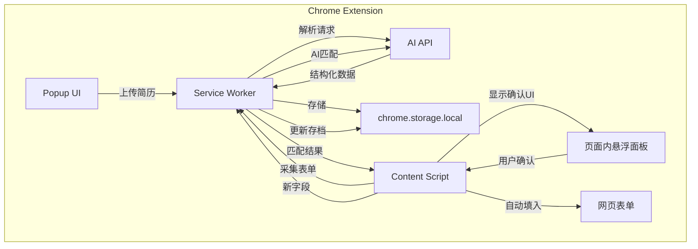

# 简历网申自动填写 Chrome 插件 — 实施方案

## 背景

用户在进行在线求职申请（网申）时，大部分平台将表单分成多个步骤/页面，无法一键填入全部信息。本插件的目标是：

1. 让用户上传 PDF / Word 格式的简历，由 AI 自动解析为结构化存档
2. 在用户进行网申时，AI 识别当前页面的表单字段，自动匹配存档中最合适的内容
3. 用户确认后一键填入；对于存档中没有的新字段，监听用户手动输入并自动识别入档

---

## User Review Required

> [!IMPORTANT]
> **AI API 选择**：本方案计划使用 **多种API设置**（`gpt/claude/gemini/kimi/minimax/glm`）进行简历结构化解析和页面字段匹配。需要用户提供 API Key，Key 将仅存储在本地 `chrome.storage.local` 中。

> [!WARNING]
> **隐私说明**：简历内容和页面表单信息会发送至 AI API 进行处理。所有数据仅在本地存储，不经过任何中间服务器，但会传输至选定的 AI 服务端。

---

## 整体架构



---

## Proposed Changes

### 1. 项目基础结构

项目采用 Chrome Manifest V3 标准架构，纯原生 HTML/CSS/JS 开发，无需构建工具。

#### [NEW] [manifest.json](file:///e:/简历网页插件/manifest.json)
- MV3 配置文件
- 权限：`storage`, `activeTab`, `scripting`
- Background: Service Worker (`background.js`)
- Content Script: 匹配所有 `http/https` 页面
- Popup: `popup.html`

#### [NEW] 项目目录结构
```
e:\简历网页插件\
├── manifest.json
├── popup/
│   ├── popup.html         # 弹窗主界面
│   ├── popup.css          # 弹窗样式
│   └── popup.js           # 弹窗逻辑
├── background/
│   └── background.js      # Service Worker 消息中枢
├── content/
│   ├── content.js         # 注入页面的核心逻辑
│   └── content.css        # 悬浮面板样式
├── lib/
│   ├── pdf.min.js         # PDF.js 库
│   ├── pdf.worker.min.js  # PDF.js Worker
│   └── mammoth.browser.min.js  # Word 解析库
├── utils/
│   ├── ai-client.js       # AI API 封装
│   ├── storage.js         # chrome.storage 封装
│   └── resume-schema.js   # 简历数据 Schema 定义
├── icons/
│   ├── icon16.png
│   ├── icon48.png
│   └── icon128.png
└── styles/
    └── common.css          # 公共样式变量
```

---

### 2. 简历上传与 AI 解析

#### [NEW] [popup.html](file:///e:/简历网页插件/popup/popup.html)
- 文件上传区域（拖拽 + 点击上传，支持 `.pdf` / `.docx`）
- 已存档简历预览与编辑
- AI API Key 设置入口
- 精美的深色主题 UI，带动效

#### [NEW] [popup.js](file:///e:/简历网页插件/popup/popup.js)
- 文件读取：使用 `FileReader` API 读取用户上传的文件
- PDF 解析：调用 `pdf.js` 的 `getDocument()` → `getPage()` → `getTextContent()` 提取文本
- Word 解析：调用 `mammoth.convertToHtml()` 或 `extractRawText()` 提取文本
- 将原始文本发送至 Service Worker，由 Service Worker 调用 AI API 完成结构化

#### [NEW] [resume-schema.js](file:///e:/简历网页插件/utils/resume-schema.js)
简历数据结构化 Schema 定义，结构如下：
```json
{
  "basicInfo": {
    "fullName": "", "email": "", "phone": "",
    "address": "", "city": "", "country": "",
    "linkedIn": "", "website": "", "github": ""
  },
  "education": [{
    "school": "", "degree": "", "major": "",
    "startDate": "", "endDate": "", "gpa": "",
    "description": ""
  }],
  "workExperience": [{
    "company": "", "title": "", "location": "",
    "startDate": "", "endDate": "", "description": ""
  }],
  "skills": [""],
  "languages": [{ "language": "", "proficiency": "" }],
  "certifications": [{ "name": "", "issuer": "", "date": "" }],
  "projects": [{
    "name": "", "role": "", "description": "",
    "technologies": [""], "url": ""
  }],
  "customFields": {}
}
```

#### [NEW] [ai-client.js](file:///e:/简历网页插件/utils/ai-client.js)
- 封装 AI API 调用（支持 OpenAI GPT / 可扩展）
- `parseResume(rawText)` → 发送 Prompt 要求 AI 返回符合 Schema 的 JSON
- `matchFields(pageFields, resumeData)` → 发送页面表单字段 + 简历数据，让 AI 返回匹配映射
- `classifyNewField(fieldLabel, fieldValue)` → 识别用户新输入的字段归属

---

### 3. 页面智能识别与自动填充

#### [NEW] [content.js](file:///e:/简历网页插件/content/content.js)
**表单采集逻辑：**
- 扫描页面所有 `<input>`, `<textarea>`, `<select>` 元素
- 提取每个字段的：`label`（通过 `<label>` 关联、`aria-label`、`placeholder`、父元素文本）、`type`、`name`、`id`、当前值
- 将采集结果发送 Service Worker

**自动填充逻辑：**
- 接收 AI 匹配结果（字段 → 值 映射表）
- 对每个表单元素设值时触发原生事件（`input`, `change`, `blur`）确保各前端框架（React/Vue/Angular）正确响应
- 处理特殊控件：`<select>` 下拉选择、radio/checkbox、日期选择器

**悬浮确认面板：**
- 注入一个 Shadow DOM 隔离的悬浮面板
- 显示 AI 识别结果（字段名 → 填充值），用户可逐项确认/修改/跳过
- 「全部填入」和「逐个确认」两种模式
- 面板可拖拽、可折叠

#### [NEW] [content.css](file:///e:/简历网页插件/content/content.css)
- 悬浮面板的样式（玻璃态/毛玻璃效果，深色主题）
- 动画效果（滑入/滑出）

---

### 4. Service Worker 消息中枢

#### [NEW] [background.js](file:///e:/简历网页插件/background/background.js)
作为所有组件的消息中转和 AI 调用中心：
- 监听来自 Popup 的消息：
  - `PARSE_RESUME`：接收原始文本 → 调用 AI 解析 → 存储结构化数据
  - `GET_RESUME`：返回存档简历数据
  - `SAVE_SETTINGS`：保存 API Key 等设置
- 监听来自 Content Script 的消息：
  - `MATCH_FIELDS`：接收页面表单字段 → 调用 AI 匹配 → 返回映射结果
  - `SAVE_NEW_FIELD`：接收新字段 → 更新存档的 `customFields`

---

### 5. 未知字段自学习

在 `content.js` 中实现：
- 当 AI 匹配结果有"无法匹配"的字段时，标记为"待学习"
- 监听用户在这些字段上的手动输入（`input` / `change` 事件）
- 用户输入完成后（`blur` 事件），弹出小气泡提示："是否将此内容保存到您的简历存档？"
- 用户确认后，调用 AI 分类字段归属，存入 `customFields`
- 下次遇到相似字段时可自动匹配

---

### 6. 存储层

#### [NEW] [storage.js](file:///e:/简历网页插件/utils/storage.js)
封装 `chrome.storage.local` 操作：
- `saveResumeData(data)` / `getResumeData()`
- `saveApiKey(key)` / `getApiKey()`
- `saveCustomFields(fields)` / `getCustomFields()`
- `saveFieldHistory(domain, mappings)` / `getFieldHistory(domain)`
  - 按域名缓存表单映射历史，同一网站再次访问时无需重复调用 AI

---

## 关键技术细节

### 表单填充兼容性
```javascript
// 对 React/Vue 等框架的受控表单，需要模拟原生事件
function setFieldValue(element, value) {
  const nativeInputValueSetter = Object.getOwnPropertyDescriptor(
    window.HTMLInputElement.prototype, 'value'
  ).set;
  nativeInputValueSetter.call(element, value);
  element.dispatchEvent(new Event('input', { bubbles: true }));
  element.dispatchEvent(new Event('change', { bubbles: true }));
  element.dispatchEvent(new Event('blur', { bubbles: true }));
}
```

### AI Prompt 设计（简历解析）
```
你是一个简历解析专家。请将以下简历原文解析为 JSON 格式。
严格按照给定的 Schema 结构输出，如果某个字段在简历中没有找到，留空。
原文: {{rawText}}
Schema: {{schema}}
```

### AI Prompt 设计（字段匹配）
```
你是一个表单填写助手。以下是一个在线申请表的字段列表和用户的简历数据。
请将每个表单字段匹配到最合适的简历数据，返回 JSON 映射。
表单字段: {{pageFields}}
简历数据: {{resumeData}}
返回格式: { "fieldId": { "value": "匹配的值", "confidence": 0.95, "source": "basicInfo.email" } }
```

---

## Verification Plan

### 自动化验证
由于这是一个全新项目且为 Chrome 插件，不适合常规的 npm test 流程。关键验证方式：

1. **静态检查**：
   - 运行 `npx eslint --no-eslintrc --rule '{"no-undef": "error"}' popup/popup.js content/content.js background/background.js` 检查基本语法错误

2. **Manifest 校验**：
   - 验证 `manifest.json` 符合 MV3 规范

### 浏览器内测试
使用 browser_subagent 进行可视化测试：

1. **加载插件**：在 `chrome://extensions` 加载解包的插件，验证无报错
2. **Popup 界面**：点击插件图标，验证 Popup 正常打开、UI 正确渲染
3. **文件上传**：上传测试 PDF 文件，验证解析流程可触发（需要有效 API Key）

### 用户手动验证
> [!NOTE]
> 由于核心功能依赖 AI API 和真实网申页面，以下步骤需用户配合测试：

1. **配置 API Key**：在插件设置中输入你的 OpenAI API Key
2. **上传简历**：上传一份真实的 PDF/Word 简历，查看解析结果是否准确
3. **网申填写**：访问任意网申平台（如 Workday、Greenhouse、Lever），点击插件的「智能填写」按钮，确认 AI 匹配是否合理，自动填入是否正确
4. **新字段学习**：故意跳过一些字段让其手动填写，验证插件是否提示保存新字段
